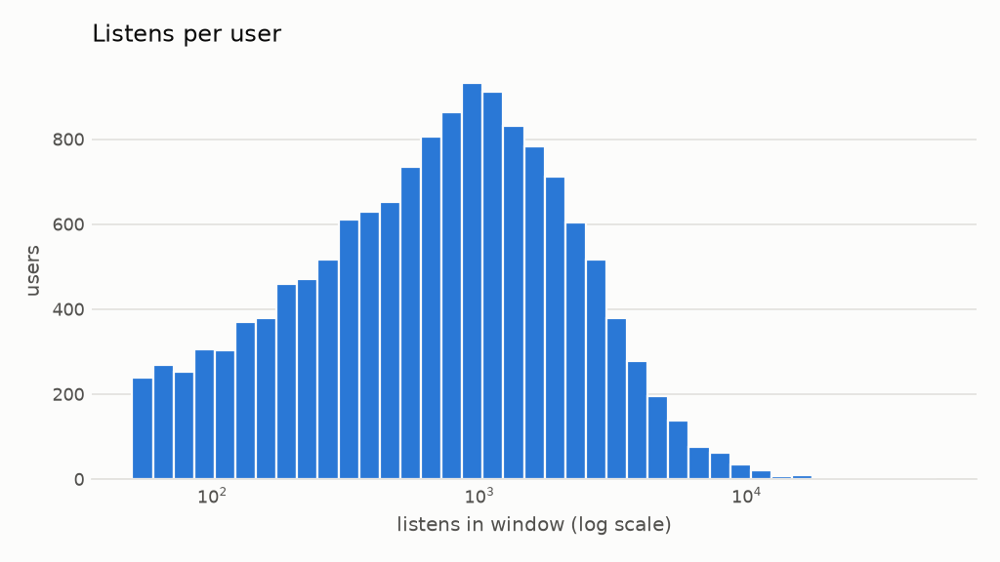
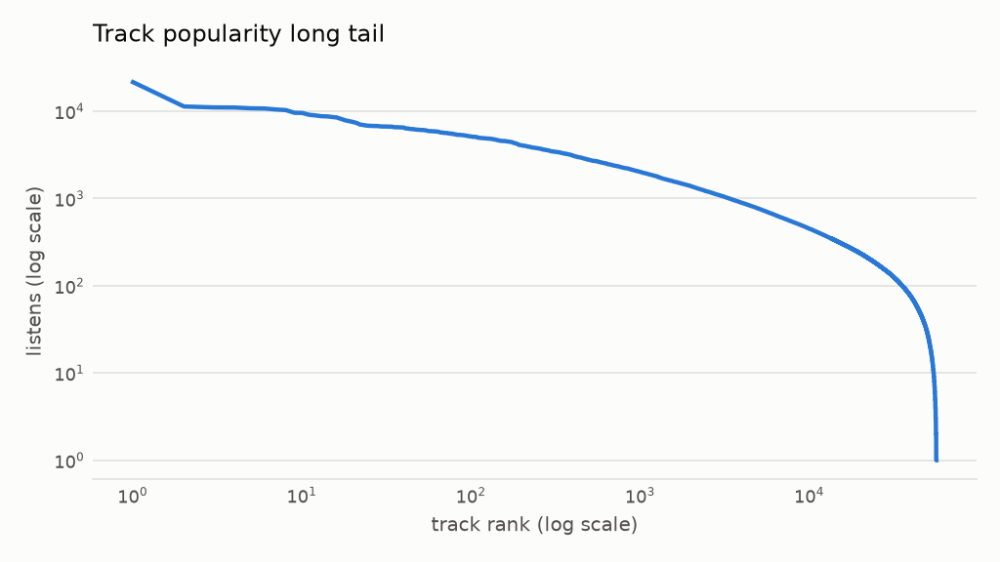
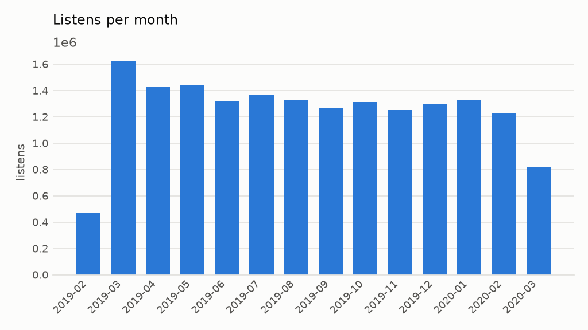

# Phase 1 data audit

Generated by `python -m m4a_rec.audit`. Do not edit by hand; rerun instead.

## Size

| | |
|---|---|
| Listens | 17,480,578 |
| Users | 14,366 |
| Tracks | 56,203 |
| First listen | 2019-02-20 12:59:52 |
| Last listen | 2020-03-20 12:59:51 |
| Matrix density | 0.6634% |

Sampled 14,366 of 14,366 eligible users (17,180 active in the window; minimum 50 listens; seed 42).

## Listens per user

| p5 | p25 | median | p75 | p95 |
|---|---|---|---|---|
| 83 | 298 | 747 | 1,545 | 3,779 |

Median unique tracks per user: 282.

## Popularity

- The top 1% of tracks take 13.2% of listens.
- Gini coefficient of track listens: 0.618.
- 1.5% of tracks have fewer than 5 listens.

## Repeat plays

- 69.4% of listens repeat a (user, track) pair already in the window.
- Unique (user, track) pairs: 5,356,483.

## Volume over time

Month-to-month variation (CV over complete months): 0.08. The first and last bars are partial months.

## Content-feature coverage

| Feature | File | Tracks covered | Listens covered |
|---|---|---|---|
| audio_ivec256 | `id_ivec256.tsv.bz2` | 100.0% | 100.0% |
| lyrics_word2vec | `id_lyrics_word2vec.tsv.bz2` | 100.0% | 100.0% |
| genres_tfidf | `id_genres_tf-idf.tsv.bz2` | 100.0% | 100.0% |
| tags | `id_tags_dict.tsv.bz2` | 99.4% | 99.8% |
