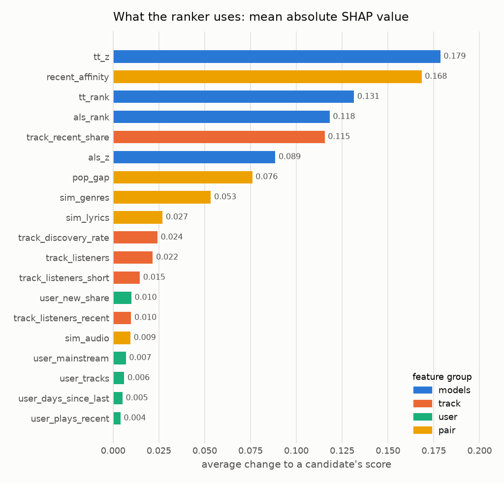

# Phase 5 ranker

Generated by `python -m m4a_rec.ranker report`. Do not edit by hand; rerun instead.

Every model here is fitted on both train splits, so the last two rows differ only in the
ranker. It reorders each user's first candidates from `tt_id`; the rest keep their order.

| Model | Setting |
|---|---|
| popularity | {"count": "users", "window_days": 180} |
| item_knn | {"weighting": "log", "k": 500} |
| als | {"factors": 256, "regularization": 0.1, "alpha": 10} |
| tt_id | {"dim": 256, "temperature": 0.1, "lr": 0.003, "log_q": true, "mask_duplicates": true, "sampling": "pairs", "hidden": 256, "dropout": 0.0} |
| tt_id + ranker | {"n_candidates": 500, "max_depth": 3, "eta": 0.1, "lambdarank_pair_method": "mean", "objective": "rank:ndcg", "trees": 250} |

## val (10,423 users scored)

Recall@K

| Model | @10 | @20 | @100 | @500 |
|---|---|---|---|---|
| popularity | 0.0046 | 0.0080 | 0.0308 | 0.0951 |
| item_knn | 0.0223 | 0.0377 | 0.1123 | 0.2917 |
| als | 0.0251 | 0.0435 | 0.1394 | 0.3507 |
| tt_id | 0.0297 | 0.0509 | 0.1510 | 0.3639 |
| tt_id + ranker | 0.0340 | 0.0569 | 0.1580 | 0.3639 |

NDCG@K

| Model | @10 | @20 | @100 | @500 |
|---|---|---|---|---|
| popularity | 0.0063 | 0.0070 | 0.0144 | 0.0313 |
| item_knn | 0.0275 | 0.0311 | 0.0554 | 0.1017 |
| als | 0.0288 | 0.0340 | 0.0649 | 0.1190 |
| tt_id | 0.0349 | 0.0405 | 0.0726 | 0.1276 |
| tt_id + ranker | 0.0395 | 0.0452 | 0.0775 | 0.1313 |

Coverage@K: share of training tracks that reach some user's top K

| Model | @10 | @20 | @100 | @500 |
|---|---|---|---|---|
| popularity | 0.0010 | 0.0018 | 0.0060 | 0.0197 |
| item_knn | 0.1987 | 0.2833 | 0.5655 | 0.8889 |
| als | 0.2196 | 0.2980 | 0.5270 | 0.7755 |
| tt_id | 0.2877 | 0.3841 | 0.6315 | 0.8520 |
| tt_id + ranker | 0.3372 | 0.4535 | 0.7162 | 0.8520 |

Short@K: share of users handed fewer than K tracks

| Model | @10 | @20 | @100 | @500 |
|---|---|---|---|---|
| popularity | 0.0013 | 0.0013 | 0.0013 | 0.0013 |
| item_knn | 0.0013 | 0.0013 | 0.0013 | 0.0015 |
| als | 0.0013 | 0.0013 | 0.0013 | 0.0013 |
| tt_id | 0.0013 | 0.0013 | 0.0013 | 0.0013 |
| tt_id + ranker | 0.0013 | 0.0013 | 0.0013 | 0.0013 |

## test (10,280 users scored)

Recall@K

| Model | @10 | @20 | @100 | @500 |
|---|---|---|---|---|
| popularity | 0.0042 | 0.0070 | 0.0292 | 0.0950 |
| item_knn | 0.0208 | 0.0369 | 0.1088 | 0.2841 |
| als | 0.0244 | 0.0427 | 0.1356 | 0.3434 |
| tt_id | 0.0278 | 0.0470 | 0.1468 | 0.3579 |
| tt_id + ranker | 0.0310 | 0.0513 | 0.1508 | 0.3579 |

NDCG@K

| Model | @10 | @20 | @100 | @500 |
|---|---|---|---|---|
| popularity | 0.0061 | 0.0065 | 0.0138 | 0.0312 |
| item_knn | 0.0276 | 0.0311 | 0.0540 | 0.0994 |
| als | 0.0284 | 0.0333 | 0.0632 | 0.1167 |
| tt_id | 0.0325 | 0.0373 | 0.0693 | 0.1244 |
| tt_id + ranker | 0.0348 | 0.0401 | 0.0719 | 0.1264 |

Coverage@K: share of training tracks that reach some user's top K

| Model | @10 | @20 | @100 | @500 |
|---|---|---|---|---|
| popularity | 0.0011 | 0.0019 | 0.0062 | 0.0200 |
| item_knn | 0.1971 | 0.2818 | 0.5641 | 0.8860 |
| als | 0.2205 | 0.2981 | 0.5267 | 0.7753 |
| tt_id | 0.2870 | 0.3838 | 0.6322 | 0.8512 |
| tt_id + ranker | 0.3346 | 0.4504 | 0.7149 | 0.8512 |

Short@K: share of users handed fewer than K tracks

| Model | @10 | @20 | @100 | @500 |
|---|---|---|---|---|
| popularity | 0.0016 | 0.0016 | 0.0016 | 0.0016 |
| item_knn | 0.0016 | 0.0016 | 0.0016 | 0.0018 |
| als | 0.0016 | 0.0016 | 0.0016 | 0.0016 |
| tt_id | 0.0016 | 0.0016 | 0.0016 | 0.0016 |
| tt_id + ranker | 0.0016 | 0.0016 | 0.0016 | 0.0016 |

## The ranker against retrieval order

`tt_id + ranker` minus `tt_id`, with a 95% interval from resampling users 2,000 times.

| Split | Metric | tt_id | tt_id + ranker | Difference | 95% interval | Relative |
|---|---|---|---|---|---|---|
| val | ndcg@10 | 0.0349 | 0.0395 | 0.0046 | +0.0033 to +0.0059 | +13.2% |
| val | ndcg@20 | 0.0405 | 0.0452 | 0.0047 | +0.0035 to +0.0059 | +11.6% |
| val | ndcg@100 | 0.0726 | 0.0775 | 0.0050 | +0.0039 to +0.0061 | +6.8% |
| val | recall@10 | 0.0297 | 0.0340 | 0.0043 | +0.0027 to +0.0058 | +14.5% |
| val | recall@20 | 0.0509 | 0.0569 | 0.0060 | +0.0039 to +0.0081 | +11.9% |
| val | recall@100 | 0.1510 | 0.1580 | 0.0070 | +0.0043 to +0.0095 | +4.6% |
| test | ndcg@10 | 0.0325 | 0.0348 | 0.0023 | +0.0010 to +0.0035 | +7.0% |
| test | ndcg@20 | 0.0373 | 0.0401 | 0.0027 | +0.0016 to +0.0039 | +7.3% |
| test | ndcg@100 | 0.0693 | 0.0719 | 0.0025 | +0.0015 to +0.0036 | +3.7% |
| test | recall@10 | 0.0278 | 0.0310 | 0.0032 | +0.0016 to +0.0046 | +11.3% |
| test | recall@20 | 0.0470 | 0.0513 | 0.0042 | +0.0024 to +0.0061 | +9.0% |
| test | recall@100 | 0.1468 | 0.1508 | 0.0040 | +0.0015 to +0.0066 | +2.7% |

## What four more weeks of training data are worth

The same model and setting, fitted on `retrieval_train` only (Phases 3 and 4) and on both train splits.

| Split | Model | Metric | retrieval_train only | Both train splits | Change |
|---|---|---|---|---|---|
| val | popularity | ndcg@10 | 0.0061 | 0.0063 | +3.8% |
| val | popularity | recall@100 | 0.0306 | 0.0308 | +0.8% |
| val | item_knn | ndcg@10 | 0.0261 | 0.0275 | +5.3% |
| val | item_knn | recall@100 | 0.1057 | 0.1123 | +6.3% |
| val | als | ndcg@10 | 0.0265 | 0.0288 | +8.6% |
| val | als | recall@100 | 0.1301 | 0.1394 | +7.1% |
| val | tt_id | ndcg@10 | 0.0320 | 0.0349 | +8.9% |
| val | tt_id | recall@100 | 0.1418 | 0.1510 | +6.5% |
| test | popularity | ndcg@10 | 0.0060 | 0.0061 | +1.0% |
| test | popularity | recall@100 | 0.0291 | 0.0292 | +0.2% |
| test | item_knn | ndcg@10 | 0.0262 | 0.0276 | +5.3% |
| test | item_knn | recall@100 | 0.1044 | 0.1088 | +4.3% |
| test | als | ndcg@10 | 0.0265 | 0.0284 | +6.9% |
| test | als | recall@100 | 0.1300 | 0.1356 | +4.3% |
| test | tt_id | ndcg@10 | 0.0304 | 0.0325 | +6.9% |
| test | tt_id | recall@100 | 0.1390 | 0.1468 | +5.6% |

## What the ranker uses

Mean absolute SHAP value: how far a feature moves a candidate's score on average.
A user feature is the same for all of a user's candidates, so on its own it moves the whole
list and changes no order; it matters only combined with other features. The ablation
below measures that.

| Feature | Group | Mean absolute SHAP | Share |
|---|---|---|---|
| tt_z | models | 0.1786 | 16.7% |
| recent_affinity | pair | 0.1684 | 15.8% |
| tt_rank | models | 0.1314 | 12.3% |
| als_rank | models | 0.1182 | 11.1% |
| track_recent_share | track | 0.1154 | 10.8% |
| als_z | models | 0.0885 | 8.3% |
| pop_gap | pair | 0.0760 | 7.1% |
| sim_genres | pair | 0.0533 | 5.0% |
| sim_lyrics | pair | 0.0270 | 2.5% |
| track_discovery_rate | track | 0.0242 | 2.3% |
| track_listeners | track | 0.0217 | 2.0% |
| track_listeners_short | track | 0.0146 | 1.4% |
| user_new_share | user | 0.0100 | 0.9% |
| track_listeners_recent | track | 0.0098 | 0.9% |
| sim_audio | pair | 0.0095 | 0.9% |
| user_mainstream | user | 0.0070 | 0.7% |
| user_tracks | user | 0.0061 | 0.6% |
| user_days_since_last | user | 0.0051 | 0.5% |
| user_plays_recent | user | 0.0040 | 0.4% |

| Group | Share |
|---|---|
| models | 48.3% |
| pair | 31.3% |
| track | 17.4% |
| user | 3.0% |

## What the ranker needs

The chosen setting retrained without one feature group at a time, on val.

| Without | ndcg@10 | recall@10 | recall@100 | Change in ndcg@10 |
|---|---|---|---|---|
| nothing (the full model) | 0.0395 | 0.0340 | 0.1580 |  |
| models | 0.0336 | 0.0281 | 0.1322 | -14.8% |
| track | 0.0381 | 0.0328 | 0.1575 | -3.4% |
| user | 0.0388 | 0.0334 | 0.1582 | -1.8% |
| pair | 0.0360 | 0.0314 | 0.1548 | -8.8% |

## One recommendation explained

User 13's top track after reordering was candidate number 35 from retrieval.
The contributions below, with the model's base value, add up to its score.

| Feature | Value | Contribution |
|---|---|---|
| track_recent_share | 0.2602 | 0.6520 |
| tt_z | 2.4574 | 0.1706 |
| user_new_share | missing | 0.0959 |
| als_rank | 69.0000 | 0.0836 |
| pop_gap | 0.3018 | 0.0720 |
| als_z | 1.6641 | 0.0580 |
| recent_affinity | missing | -0.0555 |
| tt_rank | 35.0000 | -0.0483 |
